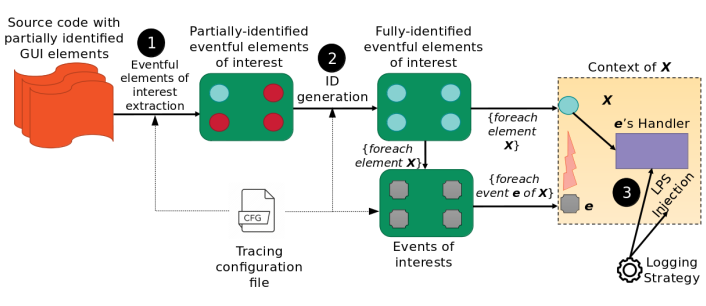
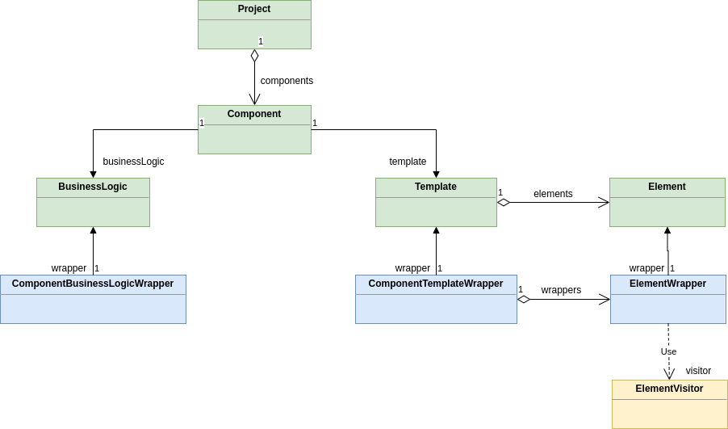
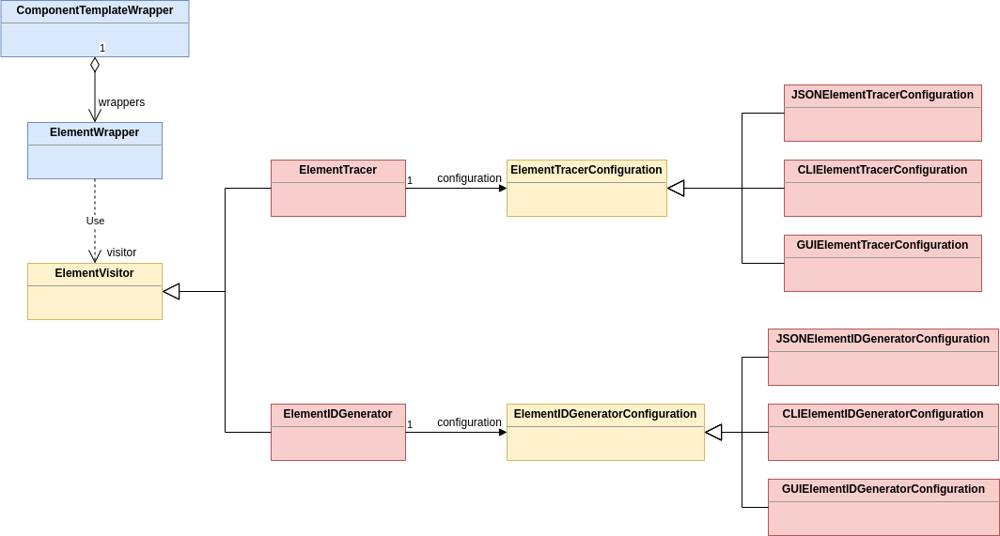
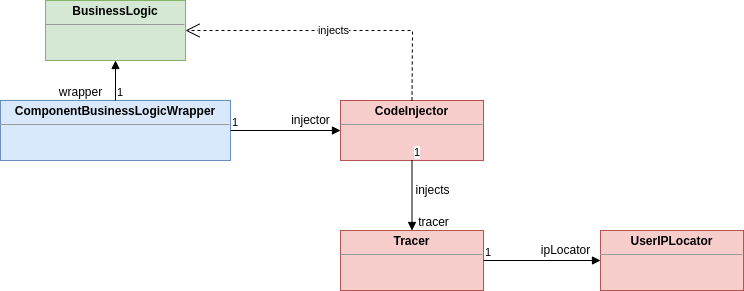

# SoftScanner's GUI Event-based Widget-oriented Logging Service
## Context
The idea is to specify events of interest that can be triggered on GUI widgets during user interaction, and provide custom tracing behavior that depends on the widget being interacted with. The first class of web applications we decided to tackle was [Angular](https://angular.io/)-based SPA's

An Angular-based SPA is a single page application that dynamically creates/updates/removes Angular components for display, animation, and user interaction. Each Angular component has an HTML template and a business logic file. These two can interact through property binding, event binding, and two-way data binding. These features enforce us thus to instrument both the business logic and the templates of each component containing widgets that can be mapped to the events of interest. These events can be chosen by the client through a configuration file, a CLI, or a GUI.

## Workflow
In a nutshell, given a project source code containing partially identified GUI widgets, the client starts by choosing his events of interest. Afterwards, all widgets having handlers for these events will be extracted. Once they're extracted, the target widgets will be examined to see whether or not they have an ID attribute. If not, then an ID generator will be used to generate an ID for each widget depending on its type and context. Once all target widgets have been identified (i.e., already have IDs or have been assigned IDs), for each widget a trace will be injected in each of its event handlers of interest. The constructed trace consists always of the [**4 Ws** (*What, Where, When, Who*)](https://scottontechnology.com/four-ws-in-logging-and-auditing/), but the content of each W depends on the type of the widget.



## Design
To instrument the project we require a project structure, and ASTs of the project's source code. This is accomplished using [**ts-morph**](https://ts-morph.com/) for the business logic and [**JSDOM**](https://github.com/jsdom/jsdom) for the template. To interact with the project's component parts, every business logic file and template file are wrapped by a **business logic wrapper** and a **template wrapper**, respectively, to facilitate the tracing process. Furthermore, every element in the template is also wrapped by a corresponding **element wrapper**, for the same reasons. Finally, all elements can be visited through their wrappers by an element **visitor** (*Visitor design pattern*). As such, an element can be traced using a special visitor, called **element tracer**. Tracing a component template is thus fine-grained and implemented at the level of its elements.



Before we trace the elements mapped to our events of interest, we have to make sure first that they have IDs, as these will be used in their corresponding traces. Elements not having ID attributes will be visited by a special visitor called
**element ID generator**. This visitor will generate an ID for a widget using one of three strategies: (1) context-aware ID generation; (2) XPath; or (3) symbolic ID generation.

The first strategy consists of generating an ID for a widget based on its **context**. The context of a widget is defined as a subset of its attributes and has a different value depending on the widget type. For example, a button widget has a context that is either derived from its name, or its value, or its Angular property `formControlType`. Sometimes IDs alone aren't enough to distinguish elements as some iterative directives like ngFor might end up replicating some elements, including their ID attributes. In this case, an ideal (*yet sometimes computationally expensive*) method is to compute its XPath value in the DOM.

Another way to distinguish elements can be achieved through **symbolic identification**. The idea simply consists of identifying the widget type and counting its occurrence across the entire DOM. For example, the 45th button in a
template will have an id "button45".

This ID generation mechanism isn't dependent on the tracing process, yet the inverse is true. In other words, it can be externalized from the source code of this microservice as its own service for later usage. For this reason, we conceived an element ID generator as having its own configuration mechanism, reified in the **element ID generator configuration** hierarchy. Nonetheless, in the context of tracing, the widgets that will be traced need to be identified in advance, and thus share the same configuration file.

Once all elements have been completely identified, we can proceed to their tracing. To map the target widgets to the events of interest, the element tracer is configured with an **element tracer configuration**, consisting of a JSON obtained from a configuration file, or through user interaction (CLI or GUI). Then, the tracing mechanism consists of finding all events of interest defined in the configuration in the templates through event binding, and prefix the invocations of their handlers by a tracing instruction located in the template's corresponding business logic file.



The tracing instruction in the business logic file is injected by a **code injector**, which creates instructions and injects them into a project's business file using ts-morph. These instructions include importing the **business logic tracer** into the component's business logic file, then creating an instance of it in the component's business logic, and adding a wrapper method to the component's business logic which invokes the tracer's actual tracing method. It is this method that is referenced in the template and that prefixes the invocation of the event handlers of interest.

The tracer imported into the business logic is dedicated to the actual building of the trace (*Builder design pattern*). It introduces methods for the building of each part of a trace's 4 Ws. Depending on the type of the widget, different values can be added to each of these parts. The Who part in particular uses a **user IP locator** which invokes a third party API to identify the IP of the user that initiated the event on the widget.



# Pre-requisites
First make sure to have [**Node.js**](https://nodejs.org/en/) and [`npm`](https://www.npmjs.com/) installed. Then, install [`typescript`](https://www.npmjs.com/package/typescript) to have the TypeScript implementation available on your machine. Next, install [`ts-node`](https://www.npmjs.com/package/ts-node) and [`npx`](https://www.npmjs.com/package/npx) to avoid precompiling TypeScript into JavaScript before execution.

```bash
# on Ubuntu
sudo npm i -g typescript
sudo npm i -g ts-node
sudo npm i -g npx
```

Finally run `npm i` to install the local Node dependencies.

# Usage with React projects
Before launching the application, you can define the events of interest in the `resources/configuration/tracing_config.json` file. By default, all supported events are enabled. So far, the supported events are as follows:

1. **click**: clickable widgets.
2. **submit**: form submissions 
3. **href**: hyperlinkable widgets 
4. **focusOut**: meaningfully focusable widgets. I.e., those widgets whose meaningful interaction requires the focus of the user, and when the interaction is over, the focus of the user goes out to another part of the application. This includes widgets like text fields, textareas, etc.
5. **change**: meaningfully changeable widgets. I.e., those widgets whose meaningful interaction requires changing their value. This includes widgets like drop-down select lists, checkboxes, radio buttons, etc.
6. **files**: file uploads.

Following the service's configuration, we can launch it with `npm start`, then provide it with the absolute path to our React `src/` folder. The service then instruments the software and adds the tracing dependency, respectively. The instrumented version of the project (*replacing the original one*) can then be executed, and the generated traces can be visualized in the console of the used browser.